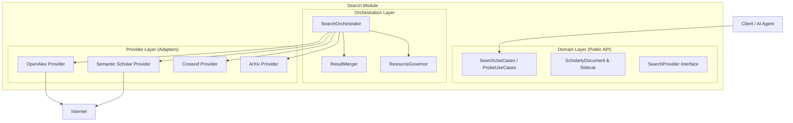

This is the **Reference Architecture for the Lumen Search Module**.

It is designed as a standalone Kotlin Multiplatform (KMP) library module. It does not know about the UI, and it does not know about the specific implementation of the Local Database (PostgreSQL). Its sole job is to **retrieve, normalize, and fuse global scholarly data** to serve as the "sensory organ" for your application and AI agents.

---

### 1. High-Level Component Diagram



---

### 2. Module Structure (Package Layout)

This structure enforces clean separation of concerns.

```text
com.lumen.search/
├── domain/                  // PURE KOTLIN (No Dependencies)
│   ├── models/              // ScholarlyDocument, Author, SearchIntent
│   ├── ports/               // Interfaces: SearchProvider, ResearchProbe
│   └── valueobjects/        // DOI, YearRange, CitationCount
│
├── data/                    // IMPLEMENTATION
│   ├── engine/              // The Orchestrator & Merger Logic
│   ├── governance/          // RateLimiting & Quotas
│   ├── mappers/             // JSON -> Domain Mappers
│   └── providers/           // OpenAlex, ArXiv, etc.
│       ├── openalex/
│       ├── semanticscholar/
│       └── crossref/
│
└── api/                     // PUBLIC ENTRY POINTS
    ├── SearchClient.kt      // The main class the rest of the app calls
    └── ProbeClient.kt       // The specific tool for the Idea Module
```

---

### 3. The Domain Layer (The "Truth")

This is the most critical part. It defines the data shape that the AI and UI will consume.

#### A. The Core Model (Discovery vs. Enrichment)

```kotlin
// domain/models/ScholarlyDocument.kt

data class ScholarlyDocument(
    // --- IDENTITY ---
    val lumenId: String,   // Internal ID (e.g., "oa:W20034...")
    val doi: String?,      // The universal key for merging
    val sourceProvider: String, // "openalex", "semanticscholar"

    // --- DISCOVERY DATA (Lite - Phase 1) ---
    val title: String,
    val authors: List<Author>,
    val publicationYear: Int?,
    val venue: String?,    // Journal or Conference name
    val citationCount: Int,
    val pdfUrl: String?,
    
    // --- ENRICHMENT DATA (Heavy - Phase 2) ---
    // These are nullable because they are fetched lazily
    val abstract: String? = null,
    val tldr: String? = null, // AI Summary from Semantic Scholar
    val concepts: List<Concept> = emptyList(),
    val references: List<String> = emptyList(), // List of DOIs/IDs
    
    // --- THE SIDECAR (Raw Data Preservation) ---
    // Keys are provider IDs ("openalex", "crossref")
    // Values are the raw JSON/Maps from the API
    val rawSourceData: Map<String, Any?> = emptyMap(),
    
    // --- STATE METADATA ---
    val isFullyHydrated: Boolean = false, // True if Enrichment has run
    val retrievalConfidence: Double = 1.0 // Lower if fuzzy matched
)

data class Author(val name: String, val id: String? = null)
data class Concept(val name: String, val score: Double)
```

#### B. The Search Intent (Input)

```kotlin
// domain/models/SearchIntent.kt

data class SearchIntent(
    val query: String,
    
    // Filters (Optional)
    val yearRange: IntRange? = null,
    val hasPdf: Boolean = false,
    
    // Mode Selection
    // DISCOVERY = Fast, Lite fields, Pagination
    // ENRICHMENT = Deep fetch for specific IDs
    val mode: SearchMode = SearchMode.DISCOVERY,
    
    // Context for AI Optimization (Optional)
    // "I am looking for medical papers" -> helps provider optimize query
    val domainContext: String? = null 
)

enum class SearchMode { DISCOVERY, ENRICHMENT }
```

---

### 4. The Provider Layer (The Adapters)

This implements the **Contract** we discussed.

#### A. The Provider Interface

```kotlin
// domain/ports/SearchProvider.kt

interface SearchProvider {
    val id: String
    val capabilities: Set<Capability>

    // 1. DISCOVERY (Streaming)
    // Returns a Flow because results come in pages/streams
    fun search(intent: SearchIntent): Flow<ProviderResult>

    // 2. ENRICHMENT (Direct Fetch)
    // Fetches full details for a specific ID
    suspend fun fetchDetails(id: String): ScholarlyDocument?
    
    // 3. PROBING (Metadata Only)
    // Used by the Idea Module
    suspend fun getStats(intent: SearchIntent): SearchStatistics
    
    // 4. TOOLING (AI Support)
    // "Explain to me what you will send to the API"
    fun debugQueryTranslation(intent: SearchIntent): String
}

sealed interface ProviderResult {
    data class Success(val documents: List<ScholarlyDocument>) : ProviderResult
    data class Error(val throwable: Throwable, val canRetry: Boolean) : ProviderResult
}
```

#### B. The Provider Base Class (Handling the "Sidecar")

Every provider implementation (e.g., `OpenAlexProvider`) must follow this logic:

1.  **Map Core Fields**: Extract Title, DOI, Year.
2.  **Attach Sidecar**: Put the *entire* API response object into `rawSourceData["openalex"]`.
3.  **Respect Mode**: If `intent.mode == DISCOVERY`, strip abstract/refs to save bandwidth.

---

### 5. The Orchestration Layer (The Engine)

This is where the logic lives. It coordinates the **Merge** and **Governance**.

#### A. The Logic Flow

```kotlin
// data/engine/SearchOrchestrator.kt

class SearchOrchestrator(
    private val providers: List<SearchProvider>,
    private val merger: ResultMerger,
    private val governor: ResourceGovernor
) {
    fun executeSearch(intent: SearchIntent): Flow<ScholarlyDocument> = channelFlow {
        
        // 1. Provider Selection Strategy
        val activeProviders = providers.filter { 
            it.supports(intent) && governor.hasBudget(it.id) 
        }

        // 2. Parallel Execution
        activeProviders.forEach { provider ->
            launch {
                provider.search(intent).collect { result ->
                    when(result) {
                        is ProviderResult.Success -> {
                            // 3. Stream & buffer for merging
                            send(result.documents) 
                        }
                        is ProviderResult.Error -> {
                            // Log error, maybe retry, do not crash
                        }
                    }
                }
            }
        }
    }
    
    // Note: Actual implementation would likely use a "running buffer" 
    // to deduplicate results that arrive within milliseconds of each other.
}
```

#### B. The Result Merger (Fusion Strategy)

```kotlin
// data/engine/ResultMerger.kt

object ResultMerger {
    fun merge(existing: ScholarlyDocument, newDoc: ScholarlyDocument): ScholarlyDocument {
        // Priority Logic: 
        // 1. Prefer Crossref for Dates
        // 2. Prefer Semantic Scholar for TLDRs
        // 3. Prefer OpenAlex for Concepts
        
        return existing.copy(
            abstract = existing.abstract ?: newDoc.abstract,
            tldr = existing.tldr ?: newDoc.tldr,
            // Merge sidecars so we lose nothing
            rawSourceData = existing.rawSourceData + newDoc.rawSourceData
        )
    }
}
```

---

### 6. The Research Probe (For the Idea Module)

This is the specialized interface strictly for your future "Idea Generation" module.

```kotlin
// domain/ports/ResearchProbe.kt

interface ResearchProbe {
    /**
     * Used to validate PICO questions.
     * Returns counts and trends, NOT papers.
     */
    suspend fun probeTopic(query: String): TopicMetrics
}

data class TopicMetrics(
    val totalPaperCount: Int,
    val volumeByYear: Map<Int, Int>, // For trend lines
    val topConcepts: List<String>    // For refining keywords
)
```

**Implementation Strategy**:
*   The `SearchOrchestrator` will implement this interface by delegating to the `getStats()` method of the providers (specifically OpenAlex, which is best for stats).

---

### 7. Resource Governance (The Safety Layer)

```kotlin
// data/governance/ResourceGovernor.kt

class ResourceGovernor {
    private val rateLimiters = mapOf(
        "openalex" to TokenBucket(capacity = 10, refillRate = 1/s),
        "semanticscholar" to TokenBucket(capacity = 5, refillRate = 1/s)
    )

    suspend fun acquirePermit(providerId: String) {
        rateLimiters[providerId]?.consume() ?: return
    }
}
```

---

### 8. How to Use It (The API Surface)

This is how your application (or AI Agent) will call this module.

#### Use Case 1: The Human Search (Discovery)
```kotlin
val client = SearchClient(orchestrator)

// Returns a Flow that updates the UI as results fly in
client.search(
    SearchIntent("Agentic RAG", mode = DISCOVERY)
).collect { batch ->
    ui.append(batch)
}
```

#### Use Case 2: The Deep Dive (Enrichment)
```kotlin
// User clicks "Details"
val fullDoc = client.enrich(
    documentId = "oa:W123...", 
    currentDoc = existingDoc // Pass existing to merge into
)
// Result: A fully hydrated document with Abstract + Sidecar
```

#### Use Case 3: The AI Feasibility Check (Probe)
```kotlin
val probe = ProbeClient(orchestrator)
val stats = probe.probeTopic("Machine Learning in Concrete Construction")

if (stats.totalPaperCount < 50) {
    ai.respond("This topic is too niche.")
}
```

---

### Summary of Design Decisions

1.  **Architecture**: Clean Architecture + Reactive Streams (Flows).
2.  **Data Strategy**:
    *   **Phase 1 (Lite)**: Optimized for list performance.
    *   **Phase 2 (Enrichment)**: Optimized for depth.
    *   **Preservation**: The `rawSourceData` Sidecar ensures the AI has access to provider-specific quirks.
3.  **Extensibility**: Adding Scopus later just means adding one file in `data/providers/scopus/` and registering it in the Orchestrator list.
4.  **AI Compatibility**: The system uses strongly typed Intent and Output models, reducing hallucination risks, while the "Probe" interface enables agentic reasoning loops.
